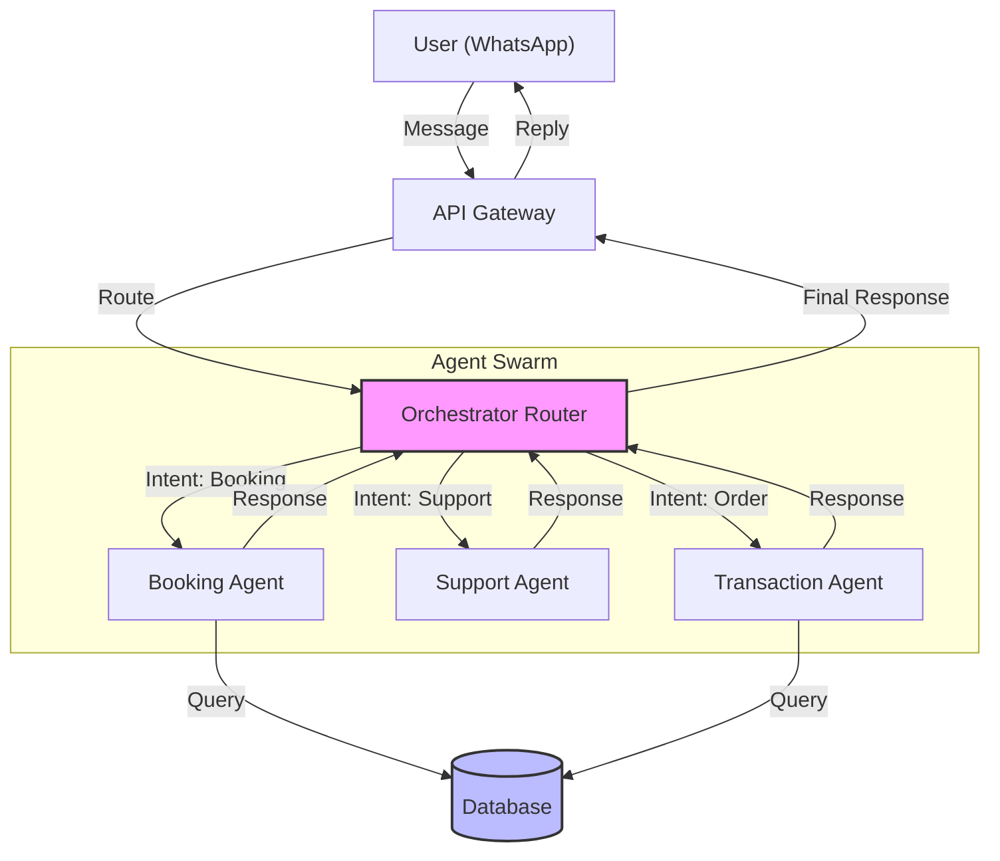
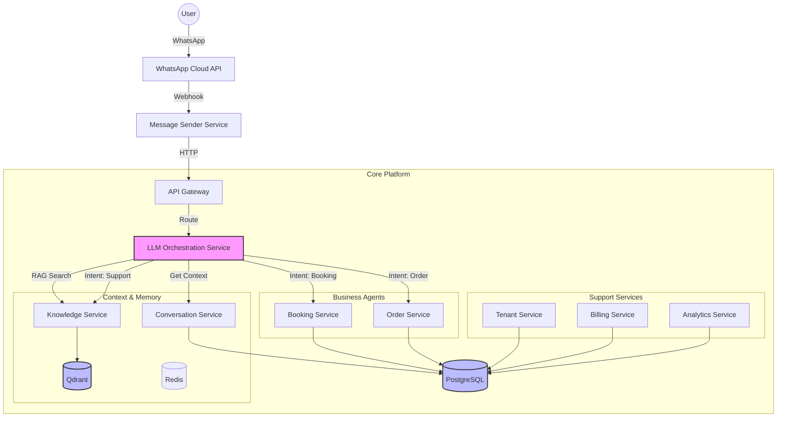
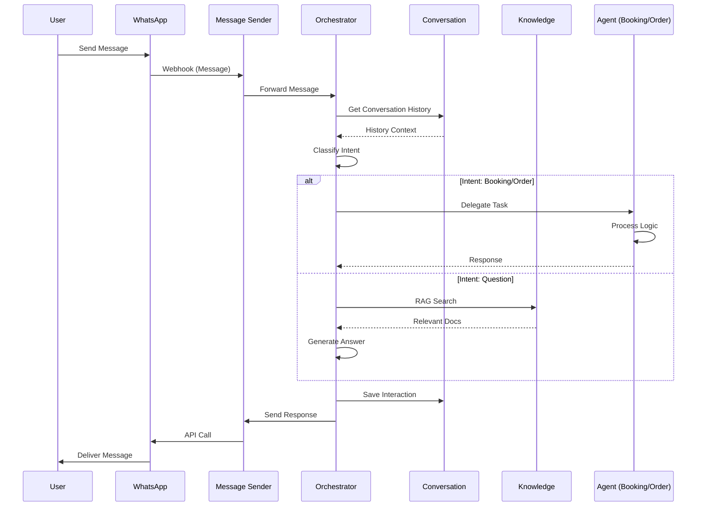
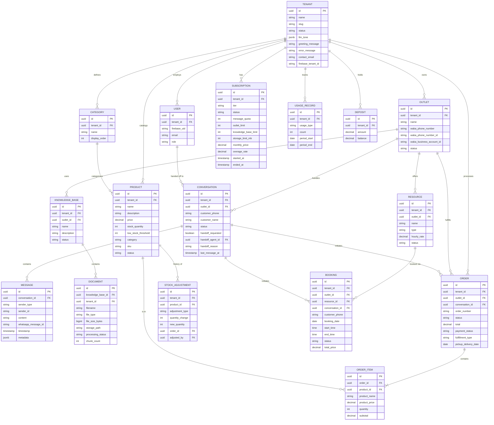
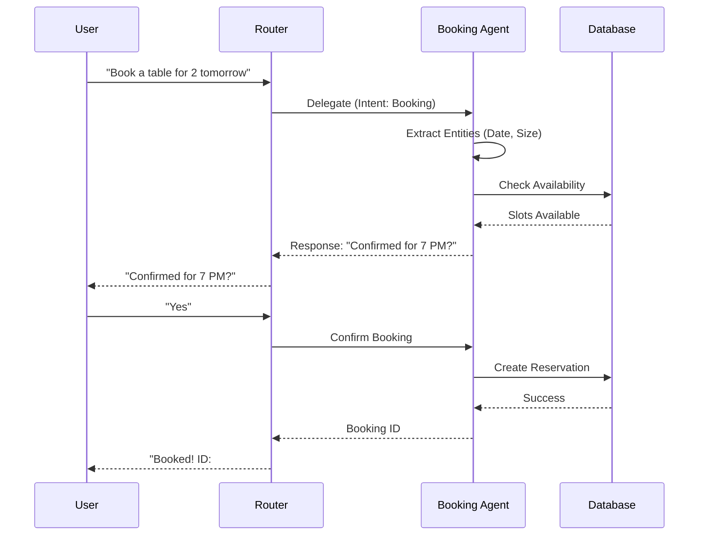
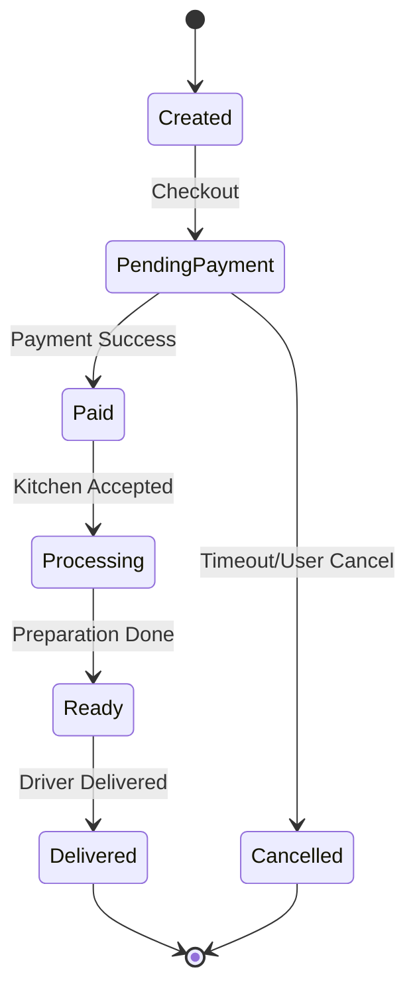

# Architecture Overview

The **CRM Product** is built on a robust Multi-Agent Architecture designed for scalability and intelligence.

## System Architecture (Flowchart)

This diagram illustrates how messages flow from the user through the API Gateway to the Orchestrator and specialized agents.

# Architecture Overview

The **CRM Product** is built on a robust Multi-Agent Architecture designed for scalability and intelligence.

## System Architecture

This diagram provides a high-level view of the **9 Microservices** that power the CRM Product, illustrating how they interact to deliver a seamless user experience.

## Data Flow (Message Lifecycle)

The following sequence diagram explains exactly how a user's message is processed from the moment it is sent on WhatsApp until a response is delivered.

## Database Schema (ERD)

The following Entity Relationship Diagram (ERD) represents the **complete and verified** data model of the CRM Product, derived directly from the database initialization and migration scripts.

## Booking Sequence Diagram

A detailed look at the interaction between the User, Router, Booking Agent, and Database during a reservation.

## Order State Diagram

The lifecycle of an order within the Transaction Agent.

## Technology Stack

| Component | Technology | Description |
| :--- | :--- | :--- |
| **Core** | **Hybrid** | Microservices architecture using Go, Python, and TypeScript |
| **Services (Go)** | Go 1.21 | High-performance services (Booking, Order, Billing, Message Sender) |
| **Services (Python)** | Python 3.11 | AI & Data services (LLM Orchestration, Knowledge, Analytics) |
| **Services (TS)** | Node.js / NestJS | Business logic services (Tenant, Conversation) |
| **Framework** | Fiber / FastAPI / NestJS | Optimized frameworks for each language |
| **LLM** | OpenAI GPT-4 | Intelligence engine |
| **Database** | PostgreSQL | Persistent storage |
| **Vector DB** | Qdrant | RAG knowledge base storage |
| **Cache** | Redis | Context and session caching |
