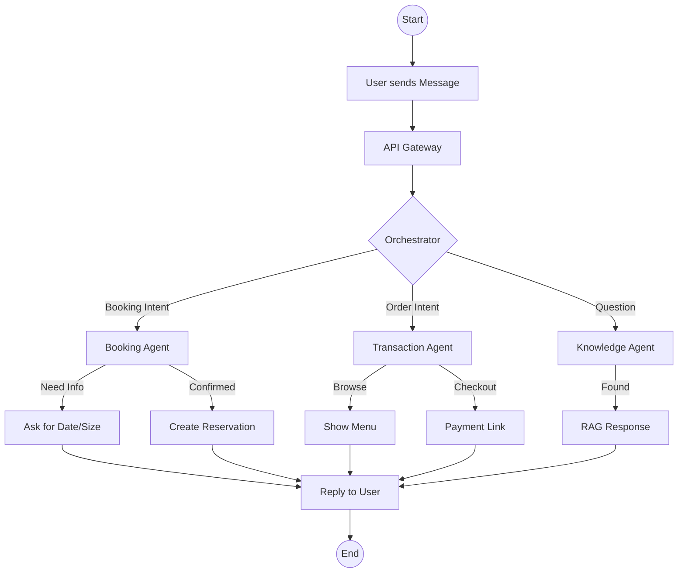

# User Journey

This guide illustrates the typical flow for an end-user interacting with the CRM Product via WhatsApp.

## Flowchart

## Steps

1.  **Initiation**: User sends a message (e.g., "I want to book a table").
2.  **Routing**: The system identifies the intent as "Booking".
3.  **Interaction**: The Booking Agent asks for details (Date, Time, Party Size).
4.  **Fulfillment**: Once details are collected, the system checks availability and confirms the booking.
5.  **Notification**: User receives a confirmation message with a Booking ID.
