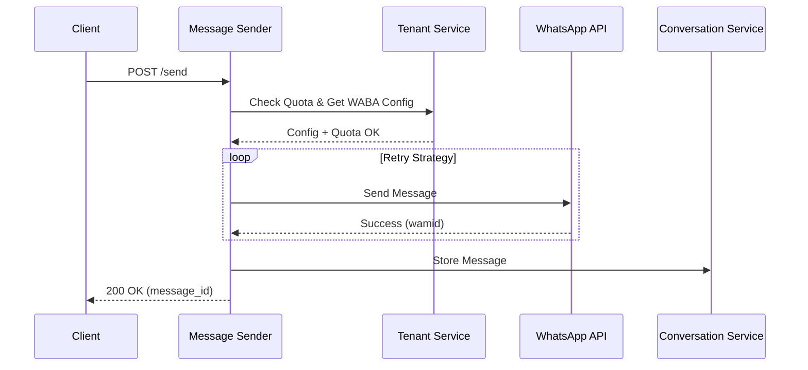

# Message Sender Service

The **Message Sender Service** is the dedicated integration layer for the WhatsApp Cloud API. It handles the reliable delivery of messages to customers, managing quotas, retries, and multi-tenant credentials.

## Overview

This service acts as the bridge between the CRM platform and the external WhatsApp network. It abstracts the complexity of the Meta Graph API, ensuring that messages are delivered efficiently and within the limits of the tenant's subscription.

### Key Features

- **WhatsApp Cloud API Integration**: Direct connection to Meta's Graph API.
- **Reliable Delivery**: Implements exponential backoff retry logic for transient failures.
- **Quota Management**: Checks tenant message quotas before sending to prevent overage.
- **Multi-Tenancy**: Dynamically loads WABA (WhatsApp Business Account) credentials per outlet.
- **Message Tracking**: Automatically syncs sent messages to the Conversation Service for history.

## Architecture

The service is built in **Go** for high concurrency and performance.

| Component | Tech Stack | Description |
| :--- | :--- | :--- |
| **Language** | Go 1.21 | Core runtime |
| **Framework** | Gin | HTTP web framework |
| **Dependencies** | Tenant Service | For WABA credentials and quota checks |
| **Dependencies** | Conversation Service | For storing message history |

### Message Pipeline



## API Reference

### Send Message

Sends a WhatsApp message to a customer.

- **Endpoint**: `POST /api/v1/messages/send`
- **Headers**: `Content-Type: application/json`

**Request Body:**

```json
{
  "tenant_id": "uuid",
  "outlet_id": "uuid",
  "conversation_id": "uuid",
  "to": "+628123456789",
  "message": "Hello! Your order is ready.",
  "message_type": "text"
}
```

**Response:**

```json
{
  "message_id": "msg-uuid",
  "whatsapp_message_id": "wamid.HBgNN...",
  "status": "sent",
  "sent_at": "2025-11-21T10:00:00Z"
}
```

### Get Message Status

Retrieves the current status of a sent message.

- **Endpoint**: `GET /api/v1/messages/:messageId/status`

**Response:**

```json
{
  "status": "delivered",
  "delivered_at": "2025-11-21T10:00:05Z"
}
```

## Retry Logic

The service uses an **Exponential Backoff** strategy to handle temporary network issues or WhatsApp API downtime.

1.  **Attempt 1**: Immediate
2.  **Attempt 2**: Wait 1s
3.  **Attempt 3**: Wait 2s
4.  **Attempt 4**: Wait 4s

If all retries fail, the service returns a `500 Internal Server Error` and logs the failure.

## Integration

### With Tenant Service
The service queries the Tenant Service to:
1.  Verify if the tenant has remaining message quota.
2.  Retrieve the specific `waba_access_token` and `phone_number_id` for the sending outlet.

### With Conversation Service
After a successful send, the service asynchronously calls the Conversation Service to persist the message in the chat history, ensuring the LLM context remains up-to-date.
